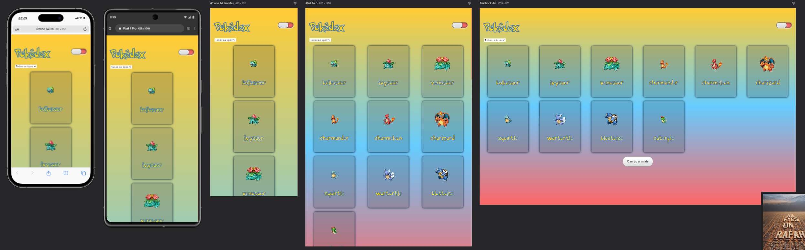
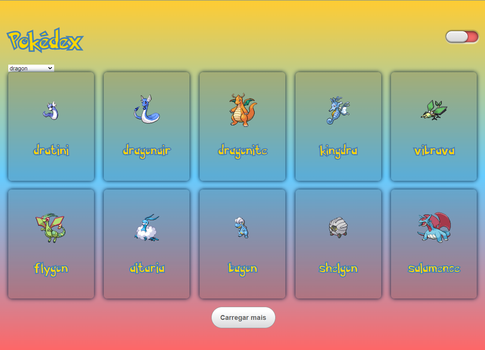
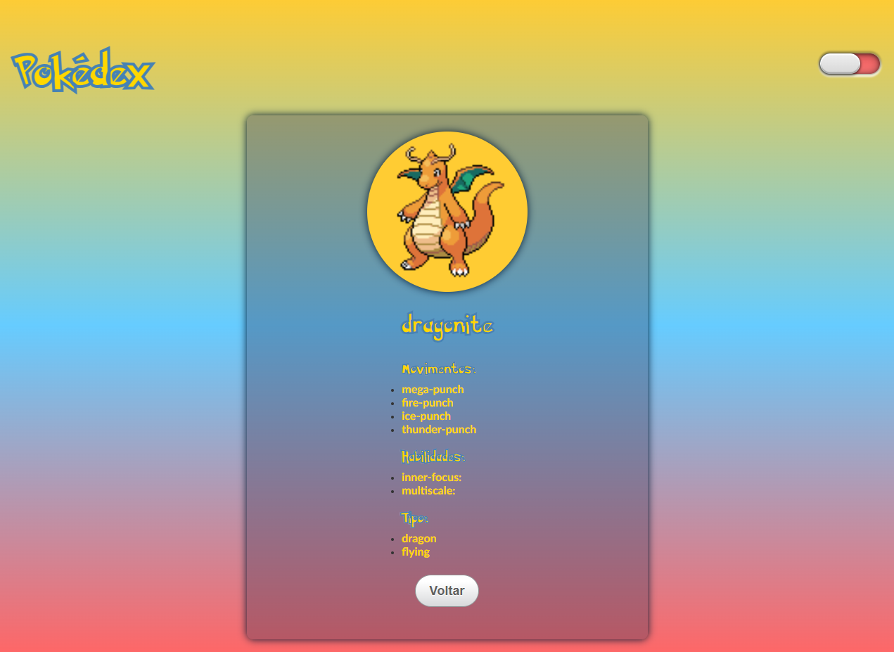
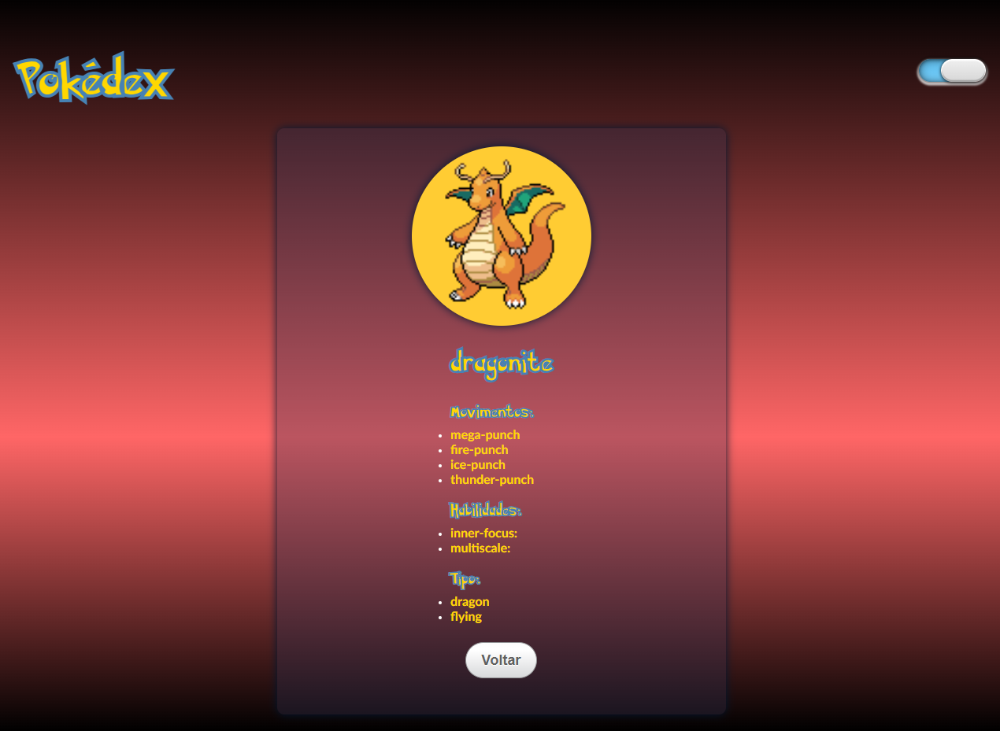

## Pokédex - React.js + Vite

Este projeto é uma Pokédex construída com React.js que permite aos usuários navegar, pesquisar e filtrar Pokémons por tipo. A aplicação busca dados da PokéAPI (https://pokeapi.co/) e exibe informações detalhadas sobre cada Pokémon, incluindo nome, imagem, tipo, habilidades e movimentos.

### Tecnologias Utilizadas

- **React.js:** Biblioteca JavaScript para construção de interfaces de usuário.
- **Axios:** Biblioteca para fazer requisições HTTP à PokéAPI.
- **Styled-Components:** Biblioteca para estilizar componentes React usando CSS-in-JS.
- **React Router DOM:** Biblioteca para roteamento e navegação em aplicações React.
- **Context API:** Para gerenciar o tema claro/escuro da aplicação.

### Imagens

Tamanhos de telas









### Aprendizados

Durante a criação deste projeto, foram aprofundados os conhecimentos em:

- **Consumo de APIs:**  Utilização do Axios para fazer requisições à PokéAPI, buscando dados de Pokémons e tipos.
- **Gerenciamento de Estado:** Utilização de `useState` e `useRef` para gerenciar o estado da aplicação, como a lista de Pokémons, paginação, filtro e tema.
- **Efeitos Colaterais (`useEffect`):**  Utilização de `useEffect` para buscar dados da API e atualizar o estado da aplicação após a renderização.
- **Estilização com Styled-Components:**  Criação de componentes estilizados reutilizáveis usando CSS-in-JS.
- **Roteamento com React Router DOM:**  Implementação de navegação entre a lista de Pokémons e a página de detalhes de cada Pokémon.
- **Testes com Jest:**  Criação de testes unitários para os componentes `PokemonList` e `PokemonDetails` usando Jest e React Testing Library, garantindo a qualidade do código e evitando bugs.

### Como Clonar e Rodar o Projeto

1. **Clonar o Repositório:**
   ```bash
   git clone https://github.com/seu-usuario/pokedex.git
   ```

2. **Instalar as Dependências:**
   ```bash
   cd pokedex
   npm install
   ```

3. **Iniciar o Servidor de Desenvolvimento:**
   ```bash
   npm start
   ```

4. **Acessar a Aplicação:**
   Abra o navegador e acesse `http://localhost:3000` (ou a porta que o servidor estiver utilizando).

### Considerações

- Este projeto foi criado com fins educacionais e de demonstração.
- A PokéAPI possui limites de uso, então pode haver atrasos ou erros ocasionais nas requisições.
- Sinta-se à vontade para explorar o código, modificá-lo e adaptá-lo às suas necessidades!